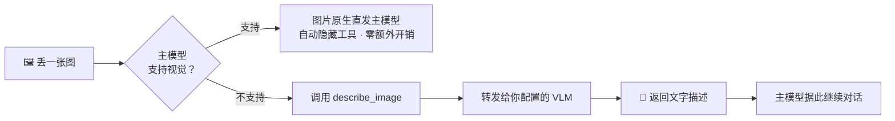

<div align="center">

# pi-vlm-proxy

**让不认识图片的模型，也能看懂图片**

给 [pi](https://pi.dev) 用的视觉代理扩展 —— 把图片识别委托给任意 OpenAI 兼容的多模态模型

[](https://www.npmjs.com/package/pi-vlm-proxy)
[](./LICENSE)
[](https://nodejs.org)
[](#开发)


<sub>主模型 <code>deepseek-v4-flash</code> 不支持视觉，图片识别被自动委托给 <code>doubao-seed-2-1-turbo</code></sub>

</div>

---

## 这是什么

DeepSeek 这类模型很强，但看不见图片。你丢一张截图过去，它只能干瞪眼。

本扩展给它加一个 `describe_image` 工具：图片先送到你指定的多模态模型那里转成文字，再交回主模型继续对话。**你不必为了看一张图就切换主模型。**



关键在于**它会自己判断该不该出场**：主模型本身支持视觉时，扩展自动隐藏工具、让图片原生透传，不产生任何额外 API 调用。切换模型时自动同步，你不需要手动开关。

## 快速开始

```bash
pi install npm:pi-vlm-proxy
```

装好后在 pi 里跑 `/vision add`，依次填四样东西：

```
模型名称:   doubao                                      ← 自己起的代号
API 地址:   https://ark.cn-beijing.volces.com/api/v3/chat/completions   ← 完整路径，不自动补后缀
API Key:    $ARK_API_KEY                                ← 支持环境变量引用
模型 ID:    doubao-seed-2-1-turbo-260628
```

完事。之后主模型遇到图片会自动调用，无需任何额外操作。

<details>
<summary>其它安装方式</summary>

```bash
# 从 GitHub 装（可指定版本）
pi install git:github.com/lawrencewzen/pi-vlm-proxy@v0.1.1

# 临时试用，只对本次运行生效，退出即消失
pi -e npm:pi-vlm-proxy
```

本地开发则在 `~/.pi/agent/settings.json` 里注册目录，改完 `/reload` 生效：

```json
{ "extensions": ["/path/to/pi-vlm-proxy"] }
```

</details>

## 特性

|  |  |
|---|---|
| 🔌 **零厂商硬编码** | 不内置任何厂商。一个模型 = API 地址 + Key + 模型 ID，三样而已 |
| 🌐 **通吃 OpenAI 格式** | 火山 Ark、阶跃 StepFun、OpenAI、通义 Qwen-VL、智谱 GLM、OpenRouter、硅基流动、本地 vLLM / Ollama / llama.cpp…… |
| 🧠 **能力感知** | 主模型支持视觉就自动隐藏自己，走原生透传；text-only 才启用代理。切换模型即同步 |
| 🔑 **密钥不落明文** | `$ENV_NAME` 引用环境变量；配置文件权限固定 `600`，展示时自动脱敏 |
| 🎛️ **五个命令** | `list` / `add` / `edit` / `remove` / `use`，或直接 `/vision` 开面板 |
| 🖼️ **两种传图** | 本地路径 `path` 或 base64 `data`（兼容粘贴的截图） |

## 命令

| 命令 | 说明 |
|------|------|
| `/vision` | 打开面板：铺出全部模型 + 当前状态 + 操作菜单 |
| `/vision list` | 列出所有已配置模型 |
| `/vision add` | 添加模型（名称 → 地址 → Key → 模型 ID） |
| `/vision edit [name]` | 编辑模型（逐字段显示当前值，**留空 = 不变**，Key 输入 `-` = 清除） |
| `/vision remove [name]` | 删除模型（有确认） |
| `/vision use [name]` | 切换当前视觉模型 |

`[name]` 可省略 —— 省略时弹出选择列表，带参数时支持 Tab 补全。

```
Vision 设置面板
⚙️ 主模型 deepseek-chat 不支持视觉 → 由 describe_image 委托下面的模型识别

📋 视觉模型 (2):
  ● doubao  (doubao-seed-2-1-turbo-260628 @ https://ark.cn-beijing.volces.com/api/v3)
    stepfun (step-3.7-flash @ https://api.stepfun.ai/v1)

  1. 切换当前模型 (use)
  2. 添加模型 (add)
  3. 编辑模型 (edit)
  4. 删除模型 (remove)
  0. 退出
```

## 配置

配置存在 `~/.pi/agent/vision-config.json`，包本身不含任何厂商信息。

```json
{
  "current": "volcengine",
  "providers": {
    "volcengine": {
      "baseUrl": "https://ark.cn-beijing.volces.com/api/v3/chat/completions",
      "apiKey": "$VOLC_ARK_KEY",
      "model": "doubao-seed-2-1-turbo-260628"
    },
    "stepfun": {
      "baseUrl": "https://api.stepfun.ai/v1/chat/completions",
      "apiKey": "$STEPFUN_KEY",
      "model": "step-3.7-flash"
    }
  }
}
```

| 字段 | 必填 | 说明 |
|------|:---:|------|
| `current` | | 当前使用的模型名，不填则用第一个 |
| `passthrough` | | 透传模式，默认 `auto`（见下）。无命令入口，手改本文件 |
| `providers.<name>.baseUrl` | ✅ | 完整 API 路径（不自动补后缀）。以 `/responses` 结尾 → Responses API；否则 → chat/completions |
| `providers.<name>.model` | ✅ | 模型 ID |
| `providers.<name>.apiKey` | | 明文或 `$ENV_NAME`，默认以 `Authorization: Bearer` 发送 |
| `providers.<name>.headers` | | 额外请求头。只有同名 `Authorization` 才覆盖默认 Bearer，配其它头不影响鉴权 |
| `providers.<name>.maxTokens` | | 输出上限，默认 4096 |
| `providers.<name>.compress` | | 是否压缩图片后发送，默认 `true`（需安装 sharp，见下） |
| `providers.<name>.maxDimension` | | 压缩时最长边像素上限，默认 1568 |
| `providers.<name>.jpegQuality` | | 压缩时 JPEG 质量 1-100，默认 85 |

> [!TIP]
> `apiKey` 推荐写成 `$VOLC_ARK_KEY` 这种形式，真值放进 shell 的 `export`。这样截图、贴配置、录屏时露出来的只是个变量名。

### 图片压缩（省 token）

安装了可选依赖 `sharp` 后，图片在发送前会被自动压缩，**payload 通常能减 4 倍左右**，直接降低视觉模型的 input token 成本与延迟：

```bash
npm install sharp          # 装到扩展的 node_modules（pi install 的扩展目录）
```

压缩策略（与 pi-vision-tool 一致）：
- 最长边超过 `maxDimension`（默认 1568px）时等比缩小
- 去掉 alpha 通道（RGBA → RGB）
- PNG / WebP / BMP 等无损格式转 JPEG（质量 `jpegQuality`，默认 85）；GIF 保持原样（动图重编码容易坏）

未安装 `sharp` 时自动退化为**原始字节直发**，功能不受影响。参数可用环境变量覆盖：`PI_VISION_MAX_DIM`、`PI_VISION_JPEG_QUALITY`。

调用方模型可在 `describe_image` 调用里用 `compress: false` 临时关掉压缩，用于需要像素级精度的场景（坐标、小字、色值）：

### API 类型自动判断

插件支持 **Chat Completions** 与 **Responses** 两种协议，按 `baseUrl` 自动判断、无需额外配置：

| `baseUrl` 结尾 | 协议 | 请求体 |
|---|---|---|
| `/responses` | Responses API | `input` + `input_image`/`input_text`，`max_output_tokens` |
| 其它（含 `/chat/completions`） | Chat Completions API | `messages` + `image_url`/`text`，`max_tokens` |

例如同一中转的两种协议可以配成两个模型：

```json
{
  "chat": { "baseUrl": "https://your-proxy/v1/chat/completions", "model": "..." },
  "resp": { "baseUrl": "https://your-proxy/v1/responses", "model": "..." }
}
```

### 透传模式

| 值 | 行为 |
|----|------|
| `auto`（默认） | 主模型 `input` 含 `"image"` → 原生透传、隐藏工具；否则启用代理 |
| `on` | 强制透传，始终隐藏 `describe_image` |
| `off` | 强制代理，始终启用 `describe_image` |

模式在模型切换时自动同步（`/model`、`Ctrl+P`、会话恢复），切换即生效并提示。

`auto` 覆盖绝大多数情况，所以没做子命令。留这个字段是给 `auto` 判断失灵时的逃生阀 —— 主模型元数据没标 `image`、或标了却调不通，手改配置即可强制。

## 工具用法

主模型看到图片时自动调用，两种传参方式：

```js
describe_image(path: "/path/to/screenshot.png")
describe_image(data: "data:image/png;base64,...", mimeType: "image/png")
describe_image(path: "/tmp/architecture.png", compress: false)   // 像素级精度场景关闭压缩
```

- **粘贴的截图** —— pi 会写入 `/tmp/pi-clipboard-*.png` 并插入路径文本，主模型拿着路径调用
- **磁盘上的图** —— 直接把路径告诉主模型即可
- **压缩** —— 装了 `sharp` 默认自动压缩省 token；需要精确坐标/小字/色值时传 `compress: false`

## 开发

```bash
npm run typecheck            # 类型检查
npm test                     # 61 项单元测试
pi -e ./extensions/index.ts  # 在 pi 里加载本地扩展试用
```

测试跑在**隔离的临时 HOME + 本地假 HTTP 端点**上，不发真实请求、不触碰真实配置：

- `test/config.test.ts` —— 读写、校验、脱敏、原子写、损坏恢复
- `test/vision.test.ts` —— 鉴权头、超时、响应形态、体积上限、类型嗅探
- `test/commands.test.ts` —— 用假 `ExtensionAPI` 驱动真实 `/vision` 命令与 `describe_image` 工具

<details>
<summary>若干行为约定</summary>

- **鉴权** —— `headers` 里没有 `Authorization`（大小写不敏感）时才自动补 `Bearer <apiKey>`
- **超时** —— 单次请求 120s 兜底；主动取消不算失败，工具返回普通结果而非错误
- **体积** —— 图片上限 10MB，超限在本地就拒绝，不会发出去换一个看不懂的 413
- **类型** —— 按文件头嗅探真实格式，`.png` 里装着 JPEG 也能正确发送
- **截断** —— 响应 `finish_reason` 为 `length` 时，在结果末尾提示调大 `maxTokens`
- **配置** —— 写入走「临时文件 + rename」原子替换，权限固定 `600`；原文件损坏时先备份为 `.bak`
- **兼容** —— 请求体用 `max_tokens`；要求 `max_completion_tokens` 的新版 OpenAI 端点暂不支持

</details>

## License

[MIT](./LICENSE) © lawrence
